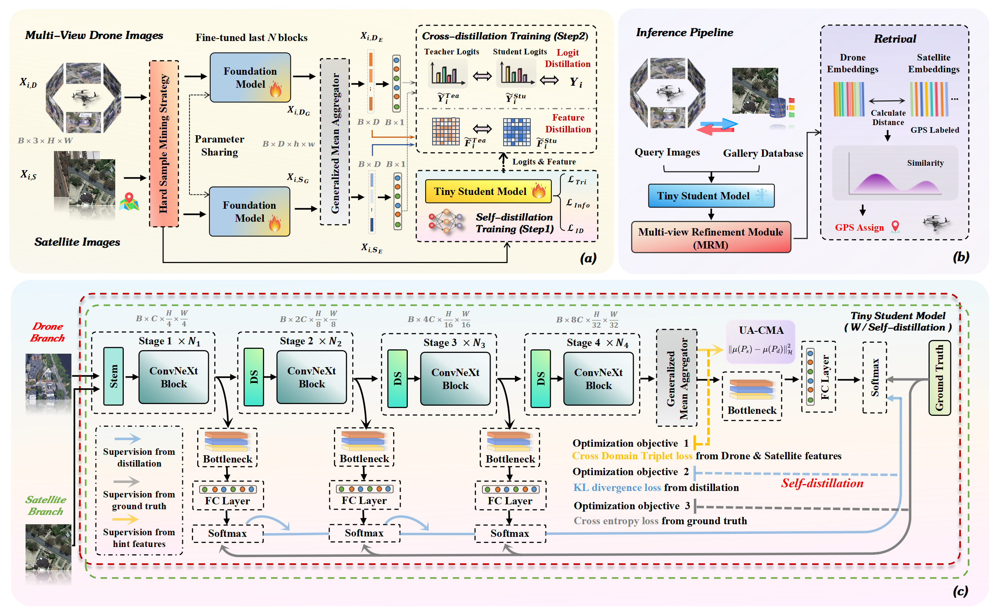

# 🌍 [Cross-View UAV Geo-Localization with Precision-Focused Efficient Design: A Hierarchical Distillation Approach with Multi-view Refinement]  


This is the official PyTorch implementation for our paper **"Cross-View UAV Geo-Localization with Precision-Focused Efficient Design: A Hierarchical Distillation Approach with Multi-view Refinement"**.

In this project, We propose **Precision-Focused Efficient Design (PFED)**, a resource-efficient framework combining hierarchical knowledge transfer and multi-view representation refinement. 🚁

---

## 🌟 Efficiency analysis


---

## 🏛️ Core Architecture

The overall architecture of our model `PFED` is illustrated below:




---

## ⚙️ Installation

We recommend using `conda` to create a virtual environment.

1.  **Clone this repository:**
    ```bash
    git clone https://github.com/SkyEyeLoc/PFED.git
    
    cd PFED
    ```

2.  **Create environment and install dependencies:**
    ```bash
    # (Optional) Using Conda
    conda create -n [your_env_name] python=3.10    
    conda activate [your_env_name]
        
    # Install dependencies
    pip install -r requirements.txt
    ```
3. **Prepare datasets:**
    
    Please download the dataset from [University1652](https://github.com/layumi/University1652-Baseline), [SUES-200](https://github.com/Reza-Zhu/SUES-200-Benchmark) and unzip it into the `./data` directory.
    
---

## 🚀 Quick Test


We provide complete scripts for training and evaluation.

### 1. Training


## 📜 TODOs

- [x] ~~Release the `requirements.txt`~~
- [x] Release the weight of the second stage
- [x] Release the ***evaluation*** code for the second stage
- [x] Release the **training** code for the second stage
- [x] Release the weight of the first stage
- [x] Release the ***evaluation*** code for the first stage
- [x] Release the **training** code for the first stage


## 📊 About Dataset


More detailed file structure:


## ⚖️ Training & Evaluation

### Training


## 🔢 Weights

[Download link](https://pan.baidu.com/s/1ZjssipR0RGfoPaETo4QhsQ?pwd=ahi4)


Choose the weight and **unzip** it. Then put it in the root path in the working directory for your repo.

PS: 

- `model_2024-11-02-03-05-31` is the weight for 30-degree UniV (2fps) and `model_2024-10-05-02_49_11` is the weight for 45-degree UniV (2fps)
  - The evaluation number should be the same as our paper
- By tuning hyper-parameter, we can get a better result.


## 📚 Table of contents

- [Getting started](#Getting-started)
- [Dataset & Preparation](#Dataset-&-Preparation)
- [Training & Evaluation](#Training-&-Evaluation)
- [Weights](#Weights)
- [Acknowledgements](#Acknowledgements)
- [Citation](#Citation)


## 🙏 Acknowledgements
Our implementation references the following excellent open-source projects: 
[University1652](https://github.com/layumi/University1652-Baseline), [Sample4Geo](https://github.com/Skyy93/Sample4Geo).
We thank the anonymous reviewers for their insightful feedback.


------

## 📄 Citation

The following paper uses and reports the result of the baseline model. You may cite it in your paper.
```bibtex
@article{ju2024video2bev,
  title={Video2bev: Transforming drone videos to bevs for video-based geo-localization},
  author={Ju, Hao and Huang, Shaofei and Liu, Si and Zheng, Zhedong},
  journal={arXiv preprint arXiv:2411.13610},
  year={2024}
}
```
Others:

```bibtex
@article{zheng2020university,
  title={University-1652: A Multi-view Multi-source Benchmark for Drone-based Geo-localization},
  author={Zheng, Zhedong and Wei, Yunchao and Yang, Yi},
  journal={ACM Multimedia},
  year={2020}
}
@article{zheng2017dual,
  title={Dual-Path Convolutional Image-Text Embeddings with Instance Loss},
  author={Zheng, Zhedong and Zheng, Liang and Garrett, Michael and Yang, Yi and Xu, Mingliang and Shen, Yi-Dong},
  journal={ACM Transactions on Multimedia Computing, Communications, and Applications (TOMM)},
  doi={10.1145/3383184},
  volume={16},
  number={2},
  pages={1--23},
  year={2020},
  publisher={ACM New York, NY, USA}
}
```

